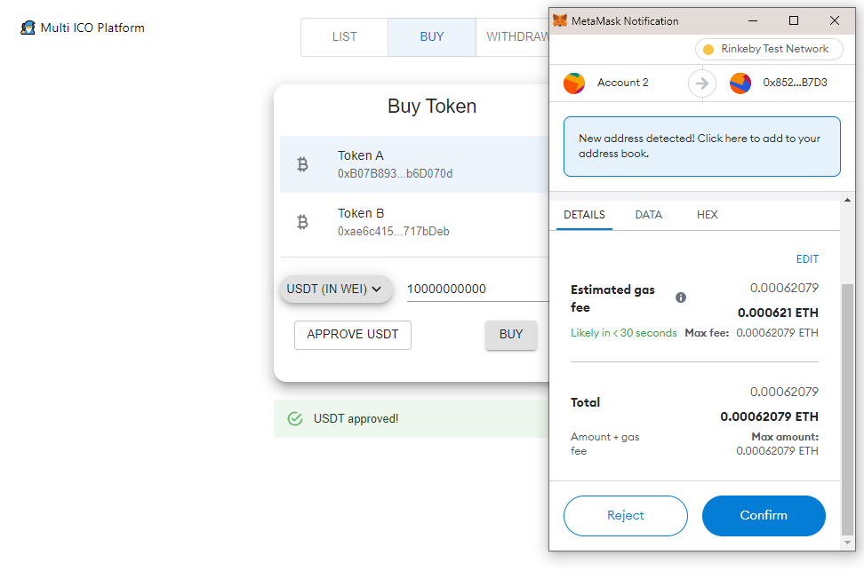

# multi_ico_platform
Ethereum erc-20 multi-ico platform:

* integration with uniswap V2 liquidity pool
* 10% of the payment amount is used to buy out the platform's ICO token from the LP and burn it
* app is deployed on rinkeby testnet

